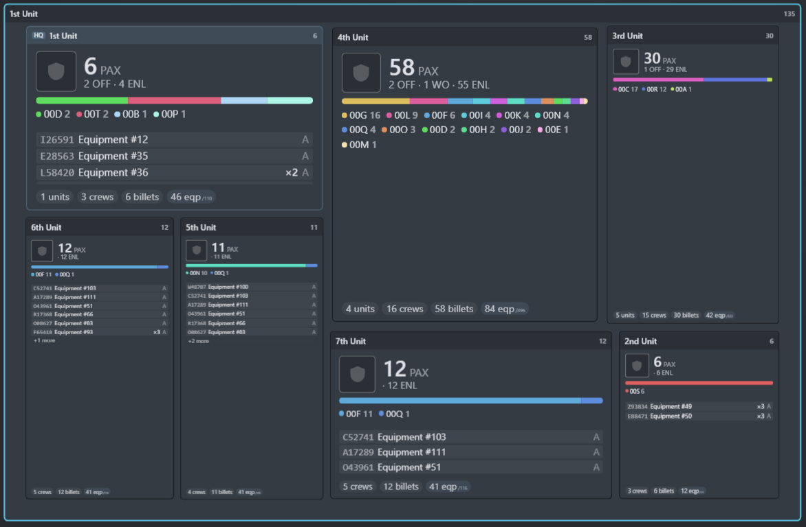

# FMSViewer

FMSViewer is an interactive web-based force structure visualization tool designed for reading, parsing, and exploring FMSWeb exports and structure models.



## Key Features

- Interactive Map Canvas: Smooth pan, zoom, and dynamic level-of-detail rendering for organizational structures.
- Unit Breakdown Tree: Vertical accordion tree view accessible via the top bar to inspect unit hierarchies and personnel totals.
- File Parsing: Supports direct import of FMSWeb spreadsheet exports (.xlsx, .xls, .csv) and pre-parsed model files (.json).
- Search and Filtering: Real-time search across unit names, UICs, MOS codes, and paragraph numbers.
- Statistics and MOS Analytics: Detailed personnel strength rollups and MOS distribution summaries.
- Data Privacy and Information Censoring: Option to obscure unit titles, personnel names, LINs, and MOS codes.
- Model Exporting: Export parsed force structures into compact JSON format for offline viewing and sharing.

## Getting Started

### Prerequisites

- Node.js version 18 or higher
- npm package manager

### Installation

1. Clone the repository:
   ```bash
   git clone https://github.com/username/FMS_Viewer.git
   ```

2. Navigate into the project directory:
   ```bash
   cd FMS_Viewer
   ```

3. Install dependencies:
   ```bash
   npm install
   ```

### Development Server

Start the local development server with hot module replacement:

```bash
npm run dev
```

Open your browser and navigate to `http://localhost:5173`.

### Production Build

Build the static site for production deployment:

```bash
npm run build
```

The compiled production bundle will be generated in the `dist` directory.

### Deployment

Deploy to GitHub Pages:

```bash
npm run deploy
```

## Usage

1. Open the application in your browser.
2. Drag and drop an FMSWeb spreadsheet file or click to select a file.
3. Use the mouse wheel to zoom, or click and drag to pan across the interactive canvas.
4. Click the Tree button in the top bar to open the vertical accordion tree view.
5. Click the Search button to locate specific units, MOS codes, or paragraph numbers.
6. Click the Stats button to view personnel strength rollups and MOS breakdowns.

## Technology Stack

- React 18
- Vite
- Bootstrap 5 and Bootswatch Slate
- SheetJS (xlsx) for spreadsheet parsing

## Author

Developed by 2LT Korbin Deary.
